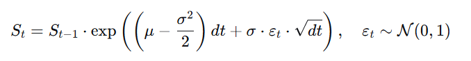
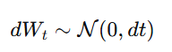
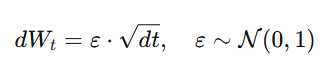
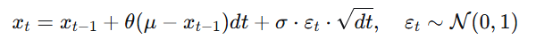

# Stochastic Processes in Finance
 
The goal of this research is to explore how different theoretical stochastic processes can be applied in real modeling.

Explore if those models are useful to simulate the behavior of financial assets.

And Prove or deny four Hypothesis on example of stock and index.

## Hypotheses

1. Returns exhibit weak-form market efficiency, meaning no significant autocorrelation in returns.

2. Asset price dynamics can be approximated by a random walk process, based on the statistical behavior of returns.

3. Returns distribution matches the assumptions of the Geometric Brownian Motion model.

4. Asset prices exhibit mean-reverting behavior, which can be detected using stationarity tests.

## Methodology
### Data
- User can choose either stock or index
- Data source: local CSV or yfinance
- csv Files Date = 12.04.2026
- Time horizon: last 505 observations (~2 years)
- Based on preferred option, will be extracted real data for processes:
  - Returns
  - Starting Price
  - Average Return (Annualized)
  - Average Volatility (Annualized)
  - Long-Term Average Price
- All calculated in logarithmic space for data consistency.

### Why logarithmic space?
All calculations are performed in logarithmic space for consistency and mathematical correctness:

Returns are additive: log(St / S(t-1))

- This allows modeling price dynamics as cumulative sums of increments, instead of multiplicative growth.
- Models like GBM are naturally defined in log-space. So it was decided to equal other processes for competent analysis.
- Volatility scales correctly with time
- Prevents distortion when comparing different processes

Prices are recovered by exponentiating the log-process.
- RW / GBM: St = S0 * exp(Xt)
- OU: St = exp(Xt), since log-price is modeled directly

### Metrics

Were calculated several metrics to explore processes nature and analyze Hypothesis. 
  - Autocorrelation (with one day lag)
  - ADF p-value (Augmented Dickey-Fuller, shows if process is stationary)
  - Skewness  (measures asymmetry in distribution)
  - Kurtosis (shows what kind of tails in distribution)
  - Maximum Drawdowns

### Simulation setup
- Number of simulations: 200
- Time step:dt = 1 / 252

All models use the same:
- starting price
- time horizon

**Random component** - Wt is a Wiener process such that: dWt ~ N(0, dt)
- The Wiener process can be seen as a random walk in continuous time. 
- It serves as the common source of randomness across all simulated processes.

### Discretization Approach
- Continuous-time stochastic differential equations (SDEs) cannot be implemented directly in code.
- Therefore, all models were transformed into discrete-time form using **Euler** discretization.

**Euler** discretization approximates continuous dynamics by replacing infinitesimal changes with small finite steps:

- dt represents a small time increment
- differential terms (dX, dWt) are replaced with discrete changes

As a result:
- deterministic components scale with dt
- stochastic components scale with √dt

This allows simulation of continuous stochastic processes using iterative updates.

## Processes

### Random Walk
Pure stochastic process - only basic external variables.

Theoretical Linear foundation:

To ensure that process in logarithmic space I needed to reformulate It. 

Let Et ~ N(0,1) be independent standard normal variables. Then:

Meaning that:

In log-space, the process evolves as a linear random walk with increments Et · √dt.

The price itself is obtained via exponentiation, making it non-linear.

**Jensen's Inequality:** 
- Geometric version is used to stay consistent with log-returns
- Due to that showed up Jensen's inequality effect (bias after exponentiation):
    - E[exp(X)] > exp(E[X])
    - Even if log-returns have zero mean, expected price grows over time.
    - This creates an upward bias in simulated paths, which is a known artifact of geometric formulation.
- In this project:
  - the effect is preserved intentionally
  - no martingale correction is applied
  - since it does not distort return-based statistics

**Note:** "Why √dt?" is gonna be explained on Geometric Brownian Motion example and is applied to every model in my project.

---

### Geometric Brownian Motion

Adds deterministic drift to random walk

Theoretical foundation:

Let Et ~ N(0,1) be independent standard normal variables. Then discrete version looks like:

Where:
- μ = Mean Annual Return
- σ = Annual Volatility

In the increment formula, the deterministic part scales with dt (linear drift over time), while the stochastic part scales with √dt.

**Why √dt?**
- In Brownian Motion applied Wiener Process as a base for stochastic part.
- In the continuous-time model, the Wiener process increment dWt has variance dt

In discrete simulation, is used Et ~ N(0,1) which has variance 1.

To transform Et ~ N(0,1) into dWt ~ N(0, dt), multiply Et by √dt (the standard deviation of dWt).

This scaling ensures that the stochastic part has the correct variance dt

**Conclusion**
- The model combines:
  - deterministic exponential growth (drift)
  - stochastic fluctuations (volatility)
- Unlike Random Walk:
  - GBM has a built-in trend
  - growth is controlled by μ

---

### Ornstein-Uhlenbeck process

Mean-reverting process.

Theoretical foundation:

Let Et ~ N(0,1) be independent standard normal variables. Then discrete version looks like:

- Et was also transformed to get Wiener's Process variance as it was in previous model.
- New variable **theta** - measures the speed of getting back to μ. (Mean Reversion part)

Where:
- μ = Long-term Mean (log price)
- θ = Speed of Mean Reversion (theta)
- σ = Annual Volatility

Notes:
- While the classical Ornstein-Uhlenbeck process is defined in linear space, I reformulated it in log-space to maintain consistency with other processes.
- Model assumes a constant long-term mean, which may not reflect real market dynamics.

**Conclusion**
- Unlike GBM, the OU process does not accumulate drift over time.
- Instead - deviations from the mean are continuously corrected and growth is suppressed.
- This explains why OU paths are will appear “flat” and fail to reproduce trending behavior of stocks
- The process is stationary in log-space (under constant μ)

---

## Stock (AAPL)

Based on the empirical AAPL data and simulated processes, it is clear that no single model fully captures real market behavior.

Each process reproduces certain aspects of price dynamics, but also fails in key areas, which allows us to evaluate the validity of the proposed hypotheses.

### Hypothesis [1] (Returns exhibit weak-form market efficiency (no autocorrelation))

| Process             | autocorrelation | 
|---------------------|-----------------|
| All Other Processes | ~ 0             | 
| AAPL                | 0.052           |

- Interpretation:
  - All models assume independent increments, which results in zero autocorrelation.
  - However, real returns show a small but non-zero autocorrelation, indicating that returns are not perfectly independent.

Hypothesis is **PARTIALLY SUPPORTED** because of low but not zero correlation.

---

### Hypothesis [2] (Asset prices follow a random walk)

| Process     | Return | Volatility| Max DD |
|-------------|--------|-----------|-------|
| Random Walk | ~ 0%   | ~ 100%    | -77%  |
| AAPL        | ~ 22%  | ~ 28%     | -33%  |

Interpretation:

- The Random Walk model represents a pure stochastic process with no structure.
- It has return almost zero and that is mathematically correct for that process, but its seem unrealistic comparing to real assets.
- Due to its geometric nature there is a high Volatility and Drawdowns (and Run-up are also should be Bigger than in real assets).
- Jensen effect shows up in Mean Price Graphic. The greater number of simulations that are being used for calculating mean, the more trend geometrically growing. 

Hypothesis is **REJECTED**
- Random Walk overestimates risk
- Fails to reproduce realistic price dynamics

---

### Hypothesis [3] (Returns distribution matches the assumptions of the Geometric Brownian Motion model)

Matches:

| Process                    | Return   | Volatility |
|----------------------------|----------|------------|
| Geometric Brownian Motion  | 20.13%   | 28.20%     |
| AAPL                       | 21.91%   | 28.14%     |

Does not match:

| Process                    | Skewness | Kurtosis |
|----------------------------|----------|----------|
| Geometric Brownian Motion  | 0        | 3        |
| AAPL                       | 0.567    | 13.77    |

Interpretation:
- Geometric Brownian Motion has been calculated using random variable Et ~ N(0,1).
- So it has no Fat Tails or Skewness
- Real asset "AAPL" otherwise has it. It is right skewed and has fat tails (Kurtosis ~ 13.8).
- GBM's volatility is based on AAPL's so it is consistently that they have same volatility.

Hypothesis is **PARTIALLY REJECTED** because gbm accurately model return and volatility, but with its N(0,1) nature cannot simulate extreme movements of real asset.

---

### Hypothesis 4 (Asset prices exhibit mean-reverting behavior, which can be detected using stationarity tests.)

ADF test was applied to price series to detect stationarity.

| Process                   | ADF price |
|---------------------------|-----------|
| Ornstein-Uhlenbeck        | 0.220     |
| Random Walk               | 0.409     |
| Geometric Brownian Motion | 0.574     |
| AAPL                      | 0.180     | 

Interpretation:
- All processes show p-value > 0.05, meaning no process is detected as stationary.
- OU has lower p-value compared to RW and GBM

Note:
- In mathematics, the Ornstein–Uhlenbeck process is a stationary Gauss–Markov process, which means that it is a Gaussian process.
- However, in this simulation, stationarity is not detected by the ADF test, due to possible reasons:
  - Limited sample size (~500 observations)
  - Weak mean reversion parameter (θ)
  - High noise relative to drift

Hypothesis is **REJECTED**

---

**Additional Graphic with first iteration:**

<!--=============================================================================================================-->
<!--=============================================================================================================-->

## Index (VIX)

Based on the VIX data and simulated processes, it is clear that no single model fully captures real market behavior.

Each process reproduces certain aspects of price dynamics, but also fails in key areas, which allows us to evaluate the validity of the proposed hypotheses.

### Hypothesis [1] (Returns exhibit weak-form market efficiency (no autocorrelation))

| Process             | autocorrelation | 
|---------------------|-----------------|
| All Other Processes | ~ 0             | 
| VIX                 | -0.057          |

- Interpretation:
  - All models assume independent increments, which results in zero autocorrelation.
  - However, real returns show a small but non-zero autocorrelation, indicating that returns are not perfectly independent.

Hypothesis is **PARTIALLY SUPPORTED** because of low but not zero correlation.

---

### Hypothesis [2] (Asset prices follow a random walk)

| Process     | Return | Volatility | Max DD |
|-------------|--------|------------|--------|
| Random Walk | 0.47%  | 100%       | -77%   |
| VIX         | 9.10%  | 142%       | -74%   |

Interpretation:

- The Random Walk model represents a pure stochastic process with no structure.
- It has return almost zero and that is mathematically correct for that process, but its seem unrealistic comparing to real assets.
- Jensen effect shows up in Mean Price Graphic. The greater number of simulations that are being used for calculating mean, the more trend geometrically growing. 
- Successes to reproduce realistic price dynamics: -77% ~ -74%

Hypothesis is **REJECTED**
- Random Walk fails to capture extreme volatility levels of VIX
- Underestimates volatility compared to real data
- Cannot reproduce correct return dynamics

---

### Hypothesis [3] (Returns distribution matches the assumptions of the Geometric Brownian Motion model)

Matches:

| Process                   | Volatility |
|---------------------------|------------|
| Geometric Brownian Motion | 142%       |
| VIX                       | 142%       |

Does not match:

| Process                     | Return     | Skewness | Kurtosis  |
|-----------------------------|------------|----------|-----------|
| Geometric Brownian Motion   | -80.05%    | 0        | 3         |
| VIX                         | 9.10%      | 0.925    | 10.113    |

Interpretation:
- Geometric Brownian Motion has been calculated using random variable Et ~ N(0,1).
- So it has no Fat Tails or Skewness
- Real asset "VIX" otherwise has it. It is right skewed and has fat tails (Kurtosis ~ 10.1).
- GBM absolutely fails in Return predicting.
- GBM's volatility is based on VIX's so it is consistently that they have same volatility.

Hypothesis is **REJECTED** because it cannot simulate anything, except volatility.

---

### Hypothesis 4 (Asset prices exhibit mean-reverting behavior, which can be detected using stationarity tests.)

ADF test was applied to price series to detect stationarity.

| Process                   | ADF price |
|---------------------------|-----------|
| Ornstein-Uhlenbeck        | 0.240     |
| Random Walk               | 0.409     |
| Geometric Brownian Motion | 0.311     |
| VIX                       | 0.000     | 

Interpretation:
- VIX is the only model that has p-value < 0.05 , ~0, meaning it is detected as stationary. 
- Mean-reverting behavior exists in real data, but is not captured by the simulated models.
- OU has lower p-value compared to RW and GBM, but still > 0.05.

Note:
- In mathematics, the Ornstein–Uhlenbeck process is a stationary Gauss–Markov process, which means that it is a Gaussian process.
- However, in this simulation, stationarity is not detected by the ADF test, due to possible reasons:
  - Limited sample size (~500 observations)
  - Weak mean reversion parameter (θ)
  - High noise relative to drift

Hypothesis is **SUPPORTED** for real data, but **NOT** reproduced by models.

---

**Additional Graphic with first iteration:**

---

## Limitations
- OU model imposes strong mean reversion, which is not observed in trending assets like stocks
- Real financial returns deviate significantly from normality.
- This explains why models like GBM, despite matching first and second moments, fail to capture extreme market behavior.
- Sample size (~500 observations) may be insufficient for reliable stationarity detection

## Final Conclusion

The study shows that classical stochastic processes are partially useful but fundamentally insufficient for realistic financial modeling.

- Random Walk fails to reproduce empirical return, volatility, and risk characteristics, meaning it is not suitable as a standalone model.
- Geometric Brownian Motion captures first and second moments (return & volatility), but fails on distributional properties (fat tails, skewness).
- Ornstein–Uhlenbeck correctly represents mean-reversion in theory, but does not generalize to trending assets and was not reliably detected in simulations.

From hypothesis testing:
- Weak-form efficiency is only approximately valid
- Random walk assumption is rejected
- GBM assumptions are partially violated in distributional properties
- Mean reversion is asset-dependent (present in index, absent in stock)

**Overall conclusion:**

Stochastic processes provide a useful theoretical framework, but real financial markets exhibit additional complexities (non-normality, regime changes, volatility clustering) that are not captured by these models.

Therefore, these processes are best treated as baseline models, not as fully adequate representations of asset dynamics.

