# Stochastic Processes in Finance
 
The goal of this research is to explore how different stochastic processes can be applied to simulate the behavior of financial assets.
Four Hypothesis were questioned and explored on different assets.

## Hypothesis

1. Market has a weak form of efficiency
2. Market follows a random walk
3. Market prices follow a lognormal distribution
4. Market is attracted to some long-term average

## Methodology
### Data
- User can choose either stock or index
- Data source: local CSV or yfinance
- csv Files Date = 12.04.2026
- Time horizon: last 505 observations (~2 years)
- Based on preferred option, will be extracted real data for processes:
  - Returns
  - Starting Price
  - Average Return (Annualized)
  - Average Volatility (Annualized)
  - Long-Term Average Price
- All calculated in logarithmic space for data consistency.

### Why logarithmic space?
All calculations are performed in logarithmic space for consistency and mathematical correctness:

Returns are additive: log(S_t / S_{t-1})

- Models like GBM are naturally defined in log-space. So it was decided to equal other processes for competent analysis.
- Volatility scales correctly with time
- Prevents distortion when comparing different processes

Final prices are converted back using: exp(log_price)

### Simulation setup
- Number of simulations: 200
- Time step:dt = 1 / 252

All models use the same:
- starting price
- time horizon

Random component: Wt ~ N(0,1)

## Processes

---

### Random Walk
Pure stochastic process - only basic external variables.

Theoretical Linear foundation:

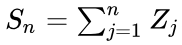

To ensure that process in logarithmic space I needed to reformulate It. 

Let Et ~ N(0,1) be independent standard normal variables. Then:

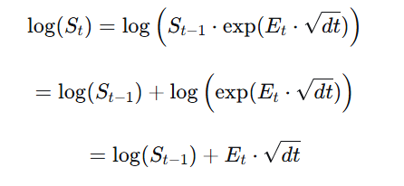

Meaning that:

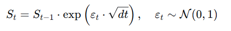

In log-space: the increment is simply Et · √dt, and the price is linear.

**Jensen's Inequality:** 
- Geometric version is used to stay consistent with log-returns
- Due to that showed up Jensen's inequality effect (bias after exponentiation):
    - E[exp(X)] > exp(E[X])
    - Even if log-returns have zero mean, expected price grows over time.
    - This creates an upward bias in simulated paths, which is a known artifact of geometric formulation.

---

### Geometric Brownian Motion

Adds deterministic drift to random walk:

(log form)

d log S = (μ - σ²/2) dt + σ dW

Where:

μ = mean annual return
σ = volatility

Key properties:

Log returns are normally distributed
Prices are lognormally distributed
No mean reversion
Trend-driven behavior

Theoretical foundation:

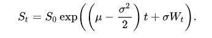

---

### Ornstein-Uhlenbeck process
Ornstein–Uhlenbeck Process (OU)

Mean-reverting process:

dX = θ(μ - X) dt + σ dW

In this project:

Applied in log-space
Then exponentiated back to price

Where:

μ = long-term mean (log price)
θ = speed of mean reversion

Key properties:

Pulls process toward mean
Stationary in log-space
Suitable for mean-reverting assets

Notes:
- While the classical Ornstein-Uhlenbeck process is defined in linear space, I reformulated it in log-space to maintain consistency with other processes.
- Model assumes a constant long-term mean, which may not reflect real market dynamics.

Theoretical foundation:

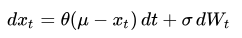

---

## Limitations
- OU does not fit to simulate single stock. shows strong attraction to the average

## Stock 

**Random walk**
**Geometric Brownian Motion**
**Ornstein-Uhlenbeck process**

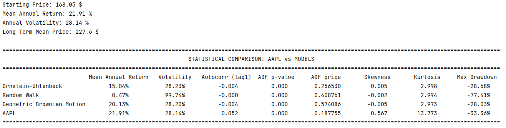
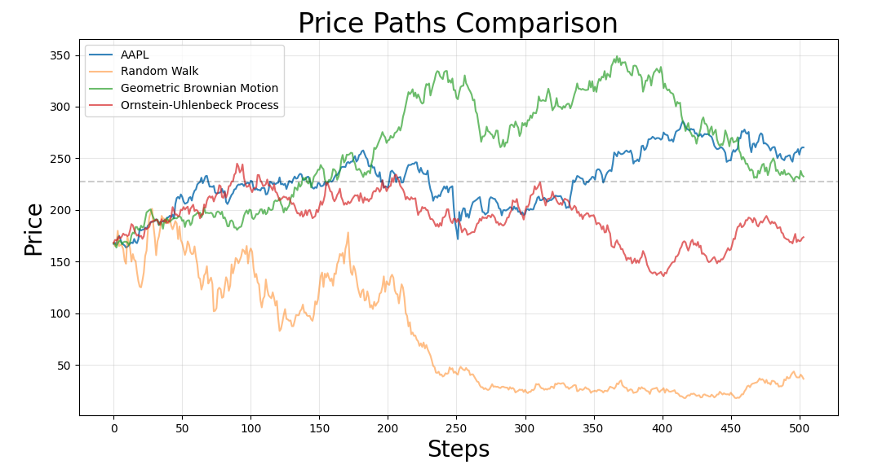
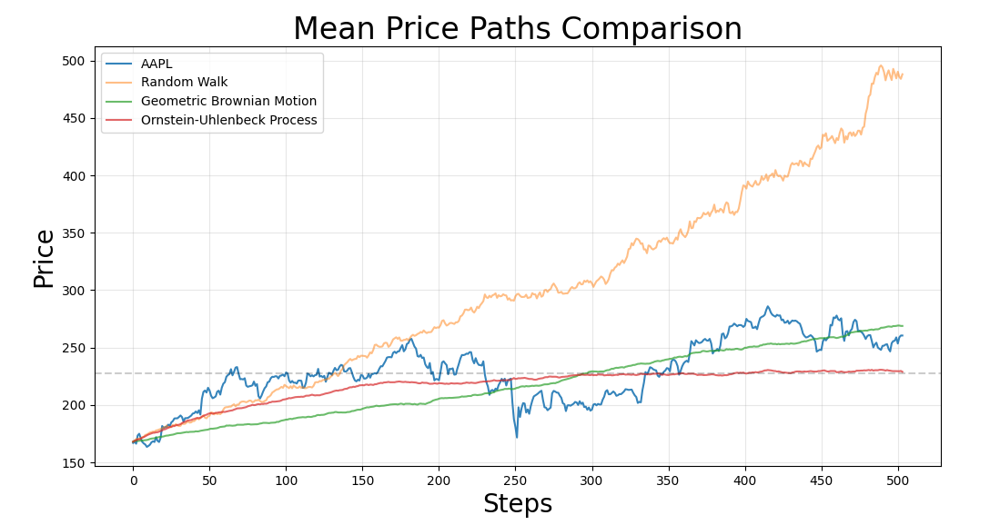
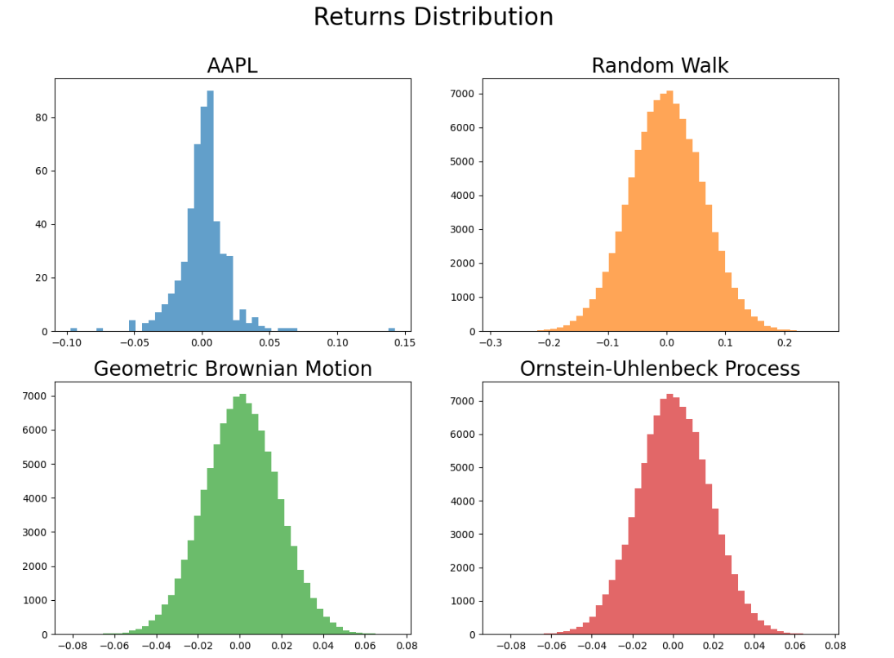
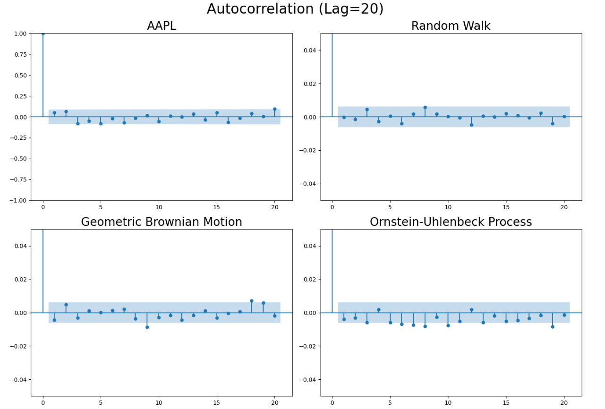

## Index

**Random walk**
**Geometric Brownian Motion**
**Ornstein-Uhlenbeck process**

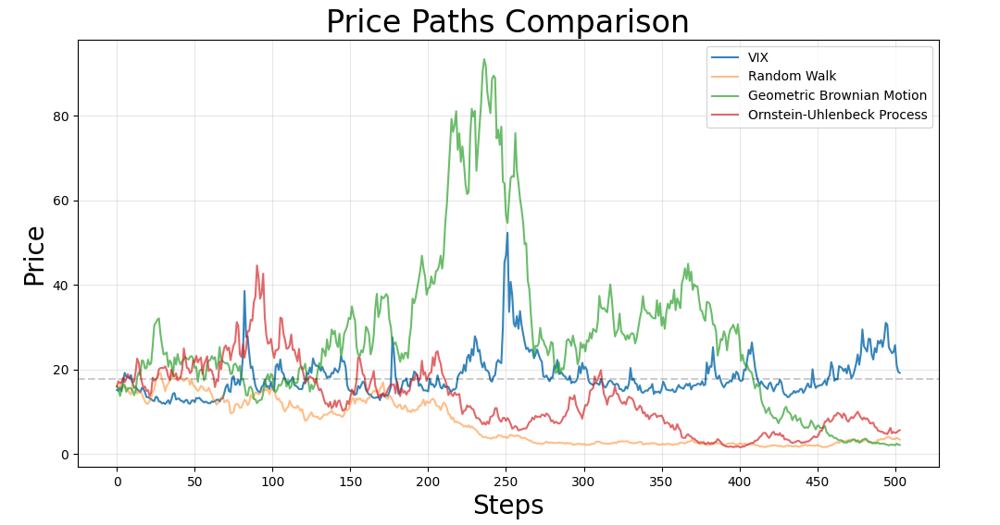
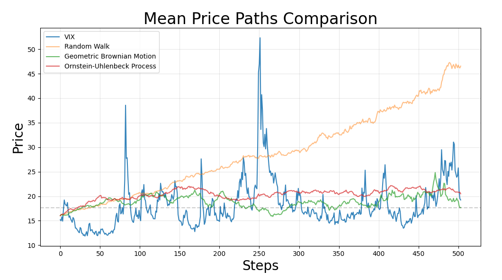
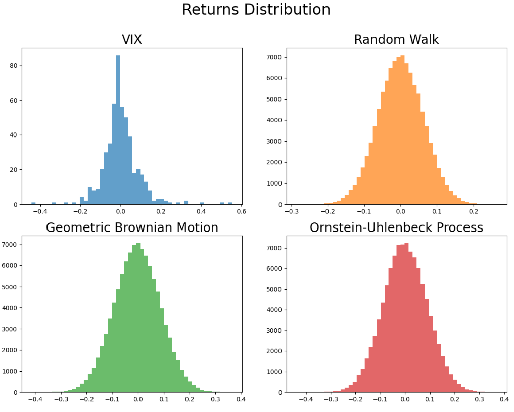
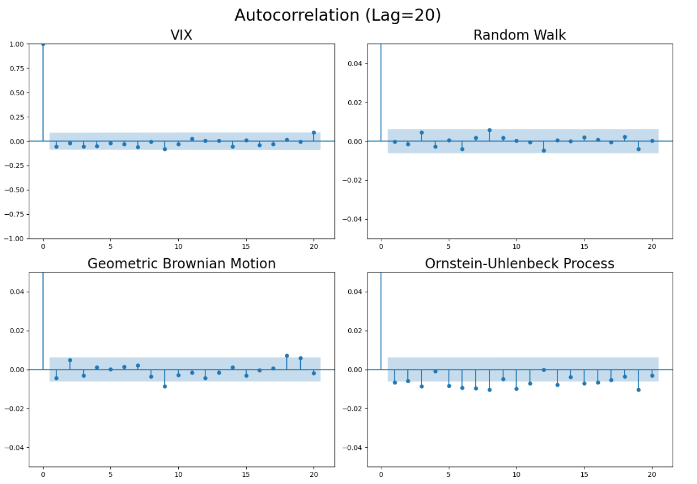

NOTES
- Most of the calculations were made using vectorization and class.

