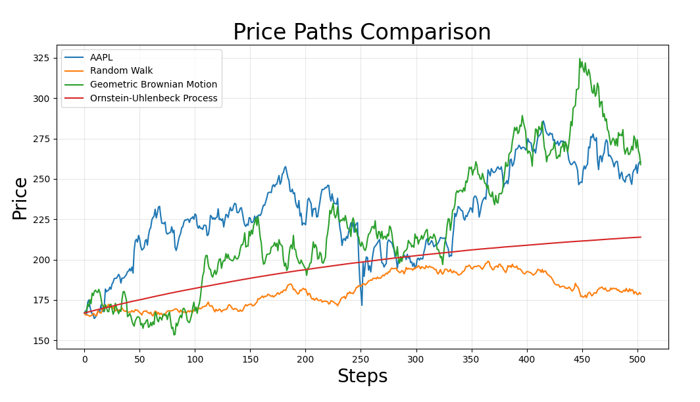
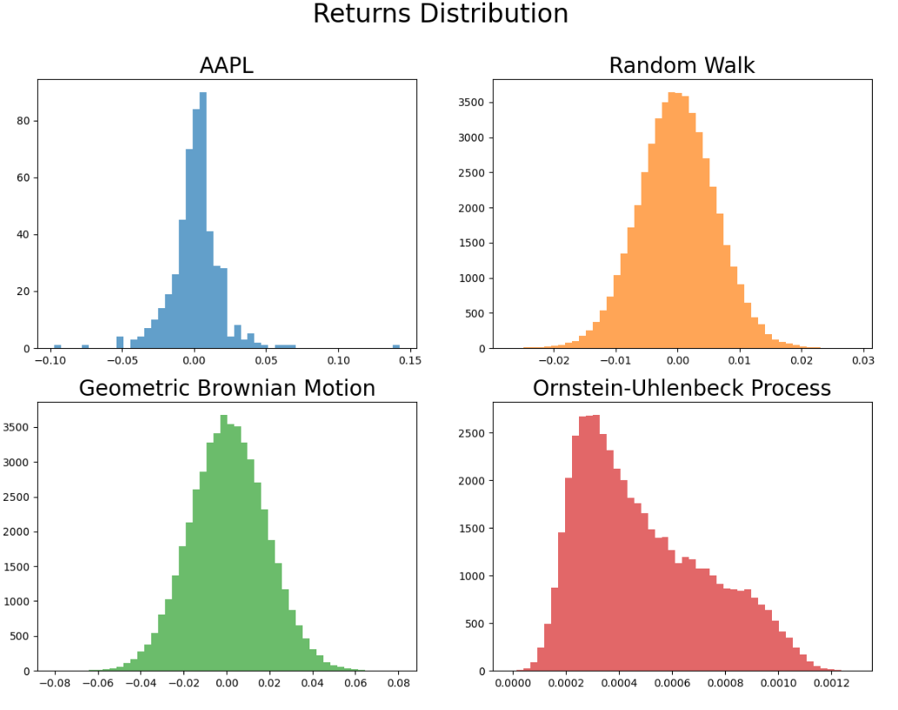
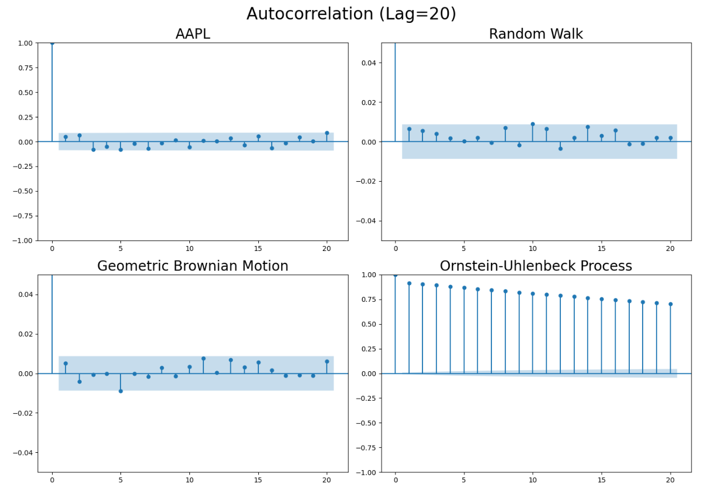

# Stochastic Processes in Finance
 
The goal of this research is to explore how different stochastic processes can be applied to simulate the behavior of financial assets.

## Hypothesis

## Processes modeling
**Random walk**

was used geometrical formula to extend logarithmic return in further analysis. due to that showed up Jensen's inequality.

**Geometric Brownian Motion**

---

**Ornstein-Uhlenbeck process**

does not fit to simulate single stock. shows strong attraction to the average

"While the classical Ornstein-Uhlenbeck process is defined in price space, I reformulated it in log-space to maintain consistency with GBM and RW models."

## Prices change

---

## Distribution

---

## Autocorrelation

