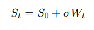
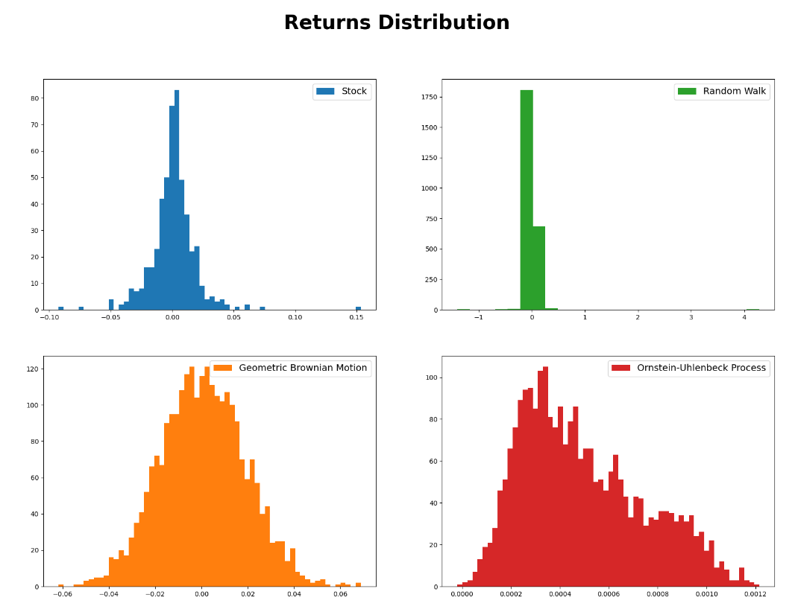

# Stochastic Processes in Finance
 
The goal of this research is to explore how different stochastic processes can be applied to simulate the behavior of financial assets.

## Processes modeling
**Random walk**

**Geometric Brownian Motion**

---

**Ornstein-Uhlenbeck process**

## Distribution

